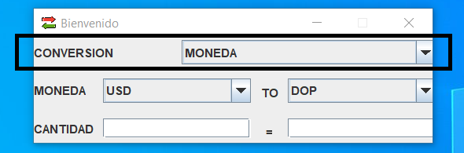
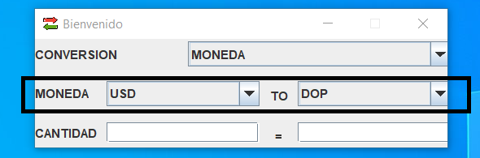
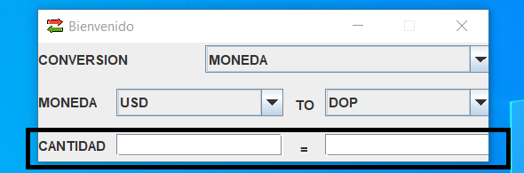
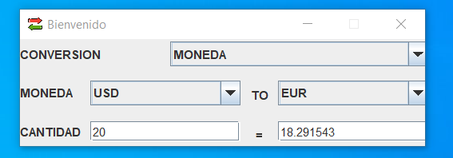

# Nombre del Repositorio: MultiConversor

### Descripción:
Este repositorio contiene una aplicación de escritorio desarrollada en Java utilizando Swing. La aplicación tiene la función de convertir monedas entre DOP, USD, EUR, JPY y KRW, así como también permite realizar conversiones de temperaturas entre Kelvin, Celsius y Fahrenheit.
para la conversion de las monedas este proyecto usa la API https://exchangerate.host
* Características:
  * ***Conversor de Monedas :***
    Permite convertir entre las siguientes monedas: DOP (Peso Dominicano), USD (Dólar Estadounidense), EUR (Euro), JPY (Yen Japonés) y KRW (Won Surcoreano).
  * ***Conversor de Temperatura :*** Permite convertir entre las siguientes escalas de temperatura: Kelvin, Celsius y Fahrenheit.

### Instrucciones de Uso:

1. Clona o descarga el repositorio en tu máquina local.
2. Abre el proyecto en tu IDE de Java preferido (por ejemplo, Eclipse, IntelliJ, NetBeans) preferiblemente IntelliJ.
3. Ejecuta la aplicación desde la clase principal src/main/java/com/contrerastorrez/Main.java.

  1. En el campo "CONVERSION" seleccione la opcion "MONEDAS" o "TEMPERATURA" dependiendo de lo que necesites convertir.

     
  2. seleccione la moneda de origen y la moneda de destino en los menús desplegables correspondientes.

     
  3. Ingrese la cantidad en cualquiera de los campos "CANTIDAD".

     
  4. el resultado se reflejará automaticamente en los mismos campos de cantidad correspiente.

     

### Estructura del proyecto: 
    MultiConversor/
    ├── src/main/java/com/contrerastorrez/
    │   ├── entitys/
    │   │   ├── Monedas.java
    │   │   └── Temperatura.java
    │   ├── views/
    │   │   ├── MainFrame.java
    │   │   └── MainFrame.form
    │   └── ...
    ├── assets/
    │   ├── session-result.png
    │   └── session-cantidad.png
    │   └── session-moneda.png
    │   └── session-conversion.png
    │   └── arrows.png
    ├── README.md
    ├── pom.xml
    └── ...
